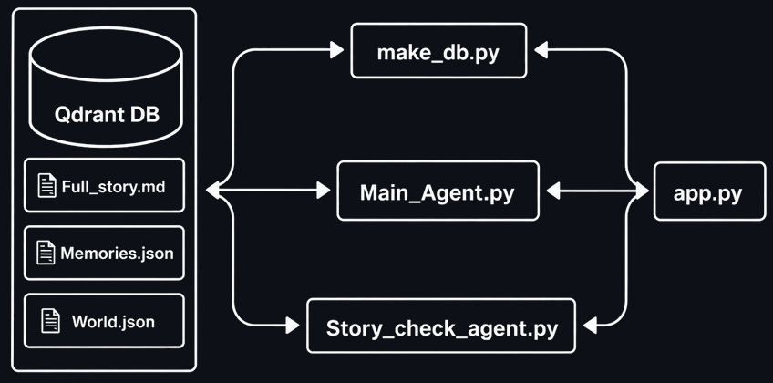

<h1 align="center">
  
Ask The Right Questions
</h1>

>**Under Active development**

A pixel-art detective game where players learn how RAG Agents works by questioning an AI with amnesia to solve a case of a missing person.

<p align="center">
  
</p>


Retrival Augmented Generation (RAG) does a good job at sounding very complex. A lot of people struggle with visulizing the Vector Space of Vector Databases and how the RAG Agent uses it to answer questions. This game is designed to help people understand how RAG Agents work by providing an interactive situation where **YOU** The **Detective** have to solve the mystery of a missing person by asking the right questions to an AI with amnesia, It will retrive the ```Top K relevant``` most similar memories from the vector database made using ```Qdrant``` and ```langchain```.

### Victory Condition
The user has to enter the best guess they have of the overall story. If the guess is good enough the user wins, else the try again.

## Architecture 

<p align="center">
  
</p>

The backend is built using ```FastAPI``` and ```Langchain``` to handle the RAG Agent. The frontend is built using ```PixiJS``` to provide a pixel-art experience. The backend is hosted on ```Render``` and the frontend is hosted on ```Vercel```.


- The full_story.md file has the full story and used by the eval agent in story_check_agent.py to check how much of the story the user has pieced together.

- The memories.json file has the individual memories thta are used to create the vector database using ```Qdrant``` and ```langchain```.

JSON Schema for memories.json:
```json
{
  "memories": [
    {
      "id": "memory_1",
      "text": "Memory content 1"
    },
    {
      "id": "memory_2",
      "text": "Memory content 2"
    }
  ]
}
```

- **make_story.md:** I made this file since i was having a hard time sitting down and manually writing the two files mentioned above. This agent asks you questions about the story and then generates the full story and memories.json file for you. You can use this to generate your own stories and memories.

- make_db.py: This script is used to handel all the database related operations.
    1. It has a function to check the database integrity
    2. It embedds all the memories in the memories.json file using ```text-embedding-3-large``` model and saves/upserts them in a ```Qdrant``` vector database.
    3. Then calculates a 2D UMAP projection of the embeddings and calculates a list of connections using an algorithm (too complex to explain here, check make_world_json in backend/make_db.py) and saves all this in ```world.json``` file.
    4. This contrains the function ```load_world_json``` which sends the world.json file to the client when the game starts. here is the schema of the world.json file:
    ```json
    [
        {
            "id": 1,
            "text": "On 17/09/2015, Ethan Mercer went missing.",
            "x": -42.27619171142578,
            "y": -98.61996173858643,
            "connections": [2,3,6,11]
        }
    ]
    ```
    5. Contains the tool ```Retrive_top_k``` used by the main agent.
- In untils.py there a debug_print function that when used instead of print, will show the time, file name and the function name from where it was called. This is useful for debugging.

## Frontend
The frontend is built using ```PixiJS``` and ```React```.

- **Tiling rules:**
- **Render Scaling Factors:**
- **Camera Controller:**
- **Rendering central and memory nodes:**

## Credits
Pixel art assets are from https://yaninyunus.itch.io/neo-zero-cyberpunk-city-tileset